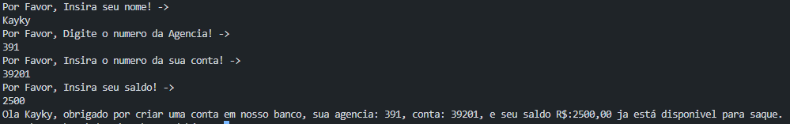

# Desafio Conta Bancária no Terminal - DIO

### Nesse desafio, utilizando a lógica básica, contruí um pequeno sistema bancario.

Utilizando apenas comandos simples, é facíl montar uma logíca que simule um pequeno "cadastro" de uma conta bancaria, que pode ser exibido todo pelo console, como visto na imagem a seguir:

